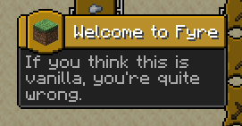
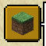
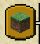
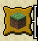
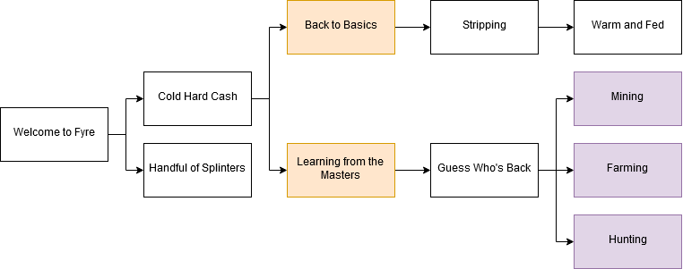
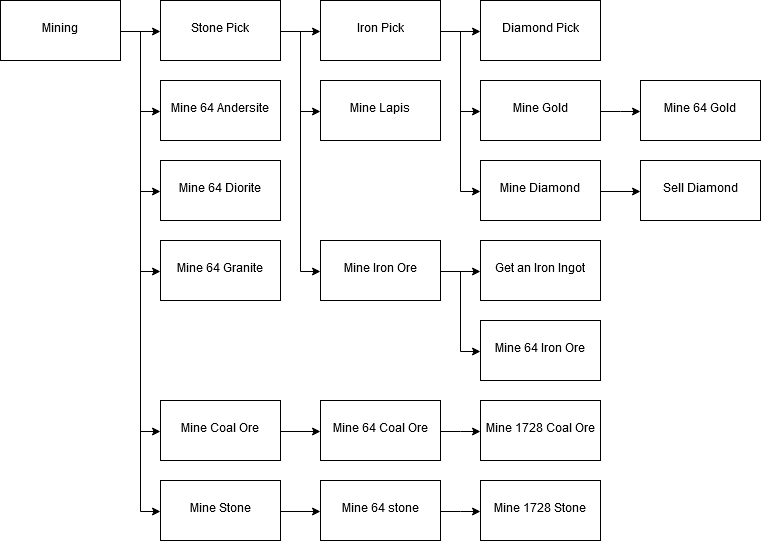

# Progression & Mechanics

Fyre is a total overhaul of the vanilla game. Because of this a rebalance of
Minecraft's progression system is needed. This is done by datapacks and server
plugins.

---

- [Progression & Mechanics](#progression--mechanics)
	- [Advancements](#advancements)
		- [Welcome to Fyre](#welcome-to-fyre)
		- [Mining](#mining)
	- [Armor Scaling](#armor-scaling)

---

## Advancements

Advancements are viewed by the client in the Advancements menu (Default keybind: `L`)
They look similar to the example below:

The `"frame"` option provides the outline shape of the advancement. There are
three options.

| Type      | Preview                                         |
| --------- | ----------------------------------------------- |
| Task      |        |
| Goal      |       |
| Challenge |  |

> The current Fyre guideline is to only use Challenge achievements for branches
> that unlock other advancement trees. In addition, tasks should not normally be
> announced to the server chat, while Goal advancements should be harder to
> obtain but announced.

---

### Welcome to Fyre

Welcome to Fyre is the introductory tree for new players. It should have enough
advancements to guide the player into using the core mechanics of Fyre. This
currently includes working with traders, buying recipes, and crafting.

| Name                      | Alt-text                                            | Requirements                                | Frame     |
| ------------------------- | --------------------------------------------------- | ------------------------------------------- | --------- |
| Welcome to Fyre           | If you think this is vanilla, you're quite wrong    | Join the Server                             | Task      |
| Cold Hard Cash            | Trade at a Vendor for some currency                 | Obtain Currency                             | Task      |
| Handful of Splinters      | Using an axe is recommended                         | Obtain Splinters                            | Task      |
| Back to Basics            | Get an axe from a lumberjack, and chop down a tree! | Obtain Logs                                 | Goal      |
| Stripping                 | Cut down a stripped log to get planks               | Obtain Planks                               | Task      |
| Warm and Fed              | Create a campfire to cook some food                 | Obtain Campfire                             | Task      |
| Learning from the Masters | Buy a crafting recipe                               | Obtain a Knowledge Book                     | Goal      |
| Guess Who's Back          | Craft a crafting table                              | Obtain Crafting Table                       | Task      |
| Mining                    | Obtain a pickaxe. Good for digging                  | Obtain any Pickaxe                          | Challenge |
| Farming                   | Obtain a hoe. Loyal till the end                    | Obtain any Hoe                              | Challenge |
| Hunting                   | Obtain a weapon. Stabby-stabby!                     | Obtain any Sword, Bow, Crossbow, or Trident | Challenge |

### Mining

Mining is the tree all about mining, and includes advancements related to mining
ores and upgrading the player's pickaxe. Note that this tree does not include
adventuring in mines at the moment, but this may change

| Name                   | Alt-text                                                          | Requirements                   | Frame |
| ---------------------- | ----------------------------------------------------------------- | ------------------------------ | ----- |
| Mining                 | Exploiting the world for all it's worth                           | Obtain any Pickaxe             | Task  |
| Stone Age              | Obtain a stone pickaxe. Actually useful                           | Obtain a Stone Pickaxe         | Task  |
| Iron Age               | Obtain an iron pickaxe. One of the best                           | Obtain an Iron or Gold Pickaxe | Goal  |
| Age of Gemstones       | Obtain an Diamond Pickaxe. Can't get better                       | Obtain a Diamond Pickaxe       | Goal  |
| Volcano Stack          | Mine a stack of Andesite. Quite Igneous                           | Plugin:Mine 64 Andesite        | Task  |
| Andesine Container     | Mine a stack of Diorite. Speckled Rock                            | Plugin:Mine 64 Diorite         | Task  |
| Intrusive Rock         | Mine a stack of Granite. Pretty in Pink?                          | Plugin:Mine 64 Granite         | Task  |
| Fossil Fuels           | Mine some Coal! Caution: Stains Hands                             | Plugin:Mine Coal Ore           | Task  |
| Dead Plant Collector   | Mine a stack of Coal. Charcoal is greener!                        | Plugin:Mine 64 Coal Ore        | Task  |
| Climate Changer        | Mine a full inventory of Coal. Do you hate the environment?       | Plugin:Mine 1728 Coal Ore      | Goal  |
| Took you long enough   | Mine some stone. Finally, we can start the game                   | Plugin:Mine Stone              | Task  |
| Stack'o Cobble         | Mine a stack of stone. Good for bridges                           | Plugin:Mine 64 Stone           | Task  |
| Red-Bearded Dwarf      | Mine a full inventory of Stone. Where's the hole?                 | Plugin:Mine 1728 Stone         | Goal  |
| No Longer in the Woods | Mine Lapis Lazuli. A Blue Magical Rock                            | Plugin:Mine Lapis              | Task  |
| Rusty Stone            | Mine some Iron Ore.                                               | Plugin:Mine Iron Ore           | Task  |
| Magnetite and Hematite | Mine a full inventory of Iron Ore. Metal of the ages, for ages!   | Plugin:Mine 1728 Iron Ore      | Task  |
| Kingmaker              | Mine some gold! You've struck riches!                             | Plugin:Mine Gold Ore           | Task  |
| Useless Material       | Mine some Diamonds! They're Kinda useless...                      | Plugin:Mine Diamond Ore        | Goal  |
| Useful Gemstone        | Sell a diamond to a merchant, They're worth it                    | Sell Diamond Ore               | Task  |
| A Small Loan           | Mine a full inventory of Gold Ore. Enough gold to rule the world! | Plugin:Mine 1728 Gold          | Task  |

*Requirements prefixed by Plugin: are triggered by [the server-side plugin](../plugin/README.md)*

## Armor Scaling

Although max hearts can be half, they do not render correctly in the client.
<!--
| Armor              | Hearts | Armor Points |
| ------------------ | ------ | ------------ |
| Leather Helmet     | 1      | 1            |
| Leather Chestplate | 2      | 3            |
| Leather Leggings   | 1      | 2            |
| Leather Boots      | 1      | 1            |
| Leather Set        | 5      | 7            |
| Chain Helmet       | 2      | 3            |
| Chain Chestplate   | 2      | 5            |
| Chain Leggings     | 2      | 4            |
| Chain Boots        | 1      | 2            |
| Chain Set          | 7      | 14           |
| Iron Helmet        | 2      | 3            |
| Iron Chestplate    | 3      | 6            |
| Iron Leggings      | 3      | 4            |
| Iron Boots         | 2      | 3            |
| Iron Set           | 10     | 16           |
| Diamond Helmet     | 3      | 4            |
| Diamond Chestplate | 5      | 7            |
| Diamond Leggings   | 4      | 5            |
| Diamond Boots      | 3      | 4            |
| Diamond Set        | 15     | 20           |
 -->

| Armor              | Hearts | Armor Points (Damage Resistance)                                                                                                                            |
| ------------------ | ------ | ----------------------------------------------------------------------------------------------------------------------------------------------------------- |
| Leather Helmet     | 1      | 1                                                                                                                  |
| Leather Chestplate | 2      | 3                                                                              |
| Leather Leggings   | 1      | 2                                                                                                                       |
| Leather Boots      | 1      | 1                                                                                                                  |
| Leather Set        | 5      | 7  (6%)                                                                                                                                                     |
| Chain Helmet       | 2      | 3                                                                              |
| Chain Chestplate   | 2      | 5                                          |
| Chain Leggings     | 2      | 4                                                                                   |
| Chain Boots        | 1      | 2                                                                                                                       |
| Chain Set          | 7      | 14 (16%)                                                                                                                                                    |
| Iron Helmet        | 2      | 3                                                                              |
| Iron Chestplate    | 3      | 6                                               |
| Iron Leggings      | 3      | 4                                                                                   |
| Iron Boots         | 2      | 3                                                                                                                       |
| Iron Set           | 10     | 16 (24%)                                                                                                                                                    |
| Diamond Helmet     | 3      | 4                                                                                   |
| Diamond Chestplate | 5      | 7      |
| Diamond Leggings   | 4      | 5                                          |
| Diamond Boots      | 3      | 4                                                                                   |
| Diamond Set        | 15     | 20 (40%)                                                                                                                                                    |

