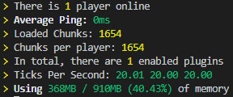
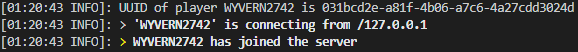

# Fyre Plugin

The Fyre Plugin is a helper plugin to implement features such as server
administration tools, merchant functionality, and a few other features.

---

- [Fyre Plugin](#fyre-plugin)
	- [Technical](#technical)
		- [Building](#building)
	- [Staff Administration Features](#staff-administration-features)

---

## Technical

The Plugin is built using Paper-api `1.14.4-R0.1-SNAPSHOT`
With gradle for compilation and building.

### Building

To build the plugin simply run `> gradlew.bat clean build` on Windows
and `$ ./gradlew clean build` on *nix

## Staff Administration Features

Separate from implementing mechanics for Fyre, the plugin also has a few tools
to assist server operators and moderators. Currently planned and implemented are:

- [x] Detailed server status
	
- [x] See incoming connections
	
	<!-- TODO: Attach image of in-game player connecting -->
- [ ] Announce when a player changes IP addresses from previous entries
	- Includes total changes, and how long between each change
		> 🐲 We will not keep a history of all addresses, only one previous.
- [ ] Announce when a player joins from someone else's IP address
	- Easily see when a banned player is attempting to use an alt account
- [ ] Private message history is saved to separate log files
	- Easily verify if someone is harassing players in private messages
